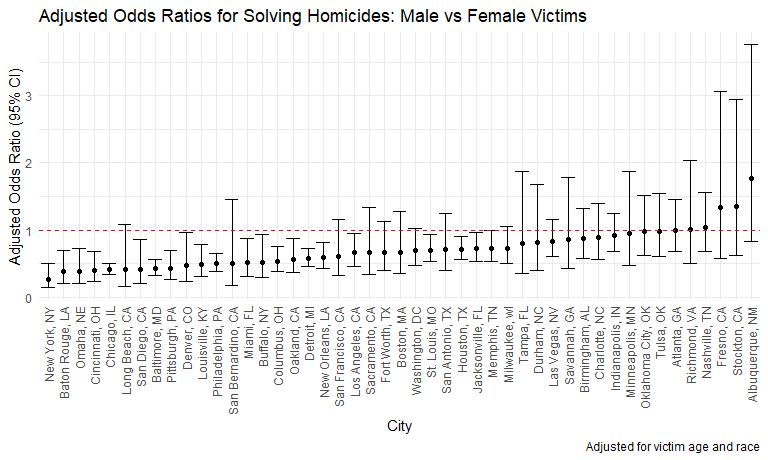
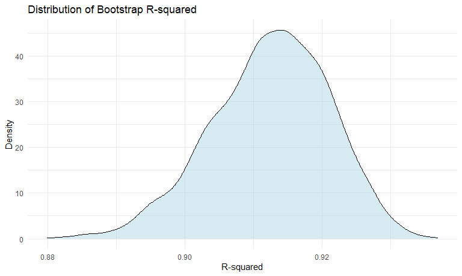
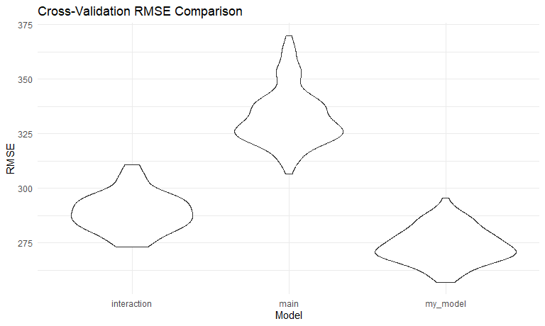

Homework 6
================
Yujie Li
2025-11-24

## Problem 1

### Load and clean the data

``` r
# Read the homicide data
homicide_df = 
  read_csv("homicide-data.csv") |> 
  janitor::clean_names()
```

    ## Rows: 52179 Columns: 12
    ## ── Column specification ────────────────────────────────────────────────────────
    ## Delimiter: ","
    ## chr (9): uid, victim_last, victim_first, victim_race, victim_age, victim_sex...
    ## dbl (3): reported_date, lat, lon
    ## 
    ## ℹ Use `spec()` to retrieve the full column specification for this data.
    ## ℹ Specify the column types or set `show_col_types = FALSE` to quiet this message.

``` r
# Create city_state variable, solved variable, and filter data
homicide_df = 
  homicide_df |> 
  mutate(
    city_state = str_c(city, ", ", state),
    solved = as.numeric(disposition == "Closed by arrest")
  ) |> 
  filter(!city_state %in% c("Dallas, TX", "Phoenix, AZ", "Kansas City, MO", "Tulsa, AL")) |> 
  filter(victim_race %in% c("White", "Black")) |> 
  mutate(victim_age = as.numeric(victim_age)) |> 
  drop_na(victim_age)
```

The dataset contains 39403 homicides from 47 cities. After filtering for
cities reporting victim race and limiting to White or Black victims, we
have data on resolved (`solved = 1`) and unresolved (`solved = 0`)
cases.

### Baltimore, MD analysis

``` r
# Filter for Baltimore and fit logistic regression
baltimore_df = 
  homicide_df |> 
  filter(city_state == "Baltimore, MD")

# Fit the logistic regression model
baltimore_fit = 
  glm(solved ~ victim_age + victim_sex + victim_race, 
      data = baltimore_df, 
      family = binomial())

# Get odds ratio and CI for male victims
baltimore_or = 
  baltimore_fit |> 
  broom::tidy() |> 
  mutate(
    OR = exp(estimate),
    CI_lower = exp(estimate - 1.96 * std.error),
    CI_upper = exp(estimate + 1.96 * std.error)
  ) |> 
  filter(term == "victim_sexMale") |> 
  select(term, OR, CI_lower, CI_upper)

baltimore_or |> 
  knitr::kable(digits = 3)
```

| term           |    OR | CI_lower | CI_upper |
|:---------------|------:|---------:|---------:|
| victim_sexMale | 0.426 |    0.325 |    0.558 |

For Baltimore, MD, the adjusted odds ratio for solving homicides
comparing male victims to female victims is 0.426 (95% CI: 0.325,
0.558), keeping all other variables fixed. This suggests that homicides
with male victims are significantly less likely to be resolved than
those with female victims.

### Analysis for all cities

``` r
# Function to fit logistic regression
fit_logistic = function(df) {
  glm(solved ~ victim_age + victim_sex + victim_race, 
      data = df, 
      family = binomial())
}

# Fit models for all cities
all_cities_results = 
  homicide_df |> 
  nest(data = -city_state) |> 
  mutate(
    fits = map(data, fit_logistic),
    results = map(fits, broom::tidy)
  ) |> 
  select(city_state, results) |> 
  unnest(results) |> 
  mutate(
    OR = exp(estimate),
    CI_lower = exp(estimate - 1.96 * std.error),
    CI_upper = exp(estimate + 1.96 * std.error)
  ) |> 
  filter(term == "victim_sexMale") |> 
  select(city_state, OR, CI_lower, CI_upper)

all_cities_results |> 
  knitr::kable(digits = 3)
```

| city_state         |    OR | CI_lower | CI_upper |
|:-------------------|------:|---------:|---------:|
| Albuquerque, NM    | 1.767 |    0.831 |    3.761 |
| Atlanta, GA        | 1.000 |    0.684 |    1.463 |
| Baltimore, MD      | 0.426 |    0.325 |    0.558 |
| Baton Rouge, LA    | 0.381 |    0.209 |    0.695 |
| Birmingham, AL     | 0.870 |    0.574 |    1.318 |
| Boston, MA         | 0.674 |    0.356 |    1.276 |
| Buffalo, NY        | 0.521 |    0.290 |    0.935 |
| Charlotte, NC      | 0.884 |    0.557 |    1.403 |
| Chicago, IL        | 0.410 |    0.336 |    0.501 |
| Cincinnati, OH     | 0.400 |    0.236 |    0.677 |
| Columbus, OH       | 0.532 |    0.378 |    0.750 |
| Denver, CO         | 0.479 |    0.236 |    0.971 |
| Detroit, MI        | 0.582 |    0.462 |    0.734 |
| Durham, NC         | 0.812 |    0.392 |    1.683 |
| Fort Worth, TX     | 0.669 |    0.397 |    1.127 |
| Fresno, CA         | 1.335 |    0.580 |    3.071 |
| Houston, TX        | 0.711 |    0.558 |    0.907 |
| Indianapolis, IN   | 0.919 |    0.679 |    1.242 |
| Jacksonville, FL   | 0.720 |    0.537 |    0.966 |
| Las Vegas, NV      | 0.837 |    0.608 |    1.154 |
| Long Beach, CA     | 0.410 |    0.156 |    1.082 |
| Los Angeles, CA    | 0.662 |    0.458 |    0.956 |
| Louisville, KY     | 0.491 |    0.305 |    0.790 |
| Memphis, TN        | 0.723 |    0.529 |    0.988 |
| Miami, FL          | 0.515 |    0.304 |    0.872 |
| Milwaukee, wI      | 0.727 |    0.499 |    1.060 |
| Minneapolis, MN    | 0.947 |    0.478 |    1.875 |
| Nashville, TN      | 1.034 |    0.685 |    1.562 |
| New Orleans, LA    | 0.585 |    0.422 |    0.811 |
| New York, NY       | 0.262 |    0.138 |    0.499 |
| Oakland, CA        | 0.563 |    0.365 |    0.868 |
| Oklahoma City, OK  | 0.974 |    0.624 |    1.520 |
| Omaha, NE          | 0.382 |    0.203 |    0.721 |
| Philadelphia, PA   | 0.496 |    0.378 |    0.652 |
| Pittsburgh, PA     | 0.431 |    0.265 |    0.700 |
| Richmond, VA       | 1.006 |    0.498 |    2.033 |
| San Antonio, TX    | 0.705 |    0.398 |    1.249 |
| Sacramento, CA     | 0.669 |    0.335 |    1.337 |
| Savannah, GA       | 0.867 |    0.422 |    1.780 |
| San Bernardino, CA | 0.500 |    0.171 |    1.462 |
| San Diego, CA      | 0.413 |    0.200 |    0.855 |
| San Francisco, CA  | 0.608 |    0.317 |    1.165 |
| St. Louis, MO      | 0.703 |    0.530 |    0.932 |
| Stockton, CA       | 1.352 |    0.621 |    2.942 |
| Tampa, FL          | 0.808 |    0.348 |    1.876 |
| Tulsa, OK          | 0.976 |    0.614 |    1.552 |
| Washington, DC     | 0.690 |    0.468 |    1.017 |

### Plot of odds ratios by city

``` r
# Create plot of ORs and CIs by city
all_cities_results |> 
  mutate(city_state = fct_reorder(city_state, OR)) |> 
  ggplot(aes(x = city_state, y = OR)) +
  geom_point() +
  geom_errorbar(aes(ymin = CI_lower, ymax = CI_upper)) +
  geom_hline(yintercept = 1, linetype = "dashed", color = "red") +
  labs(
    title = "Adjusted Odds Ratios for Solving Homicides: Male vs Female Victims",
    x = "City",
    y = "Adjusted Odds Ratio (95% CI)",
    caption = "Adjusted for victim age and race"
  ) +
  theme(axis.text.x = element_text(angle = 90, hjust = 1, vjust = 0.5))
```



The plot shows that most cities have odds ratios below 1, indicating
homicides with male victims are less likely to be solved than those with
female victims. New York, NY has the lowest OR at 0.262, while
Albuquerque, NM has the highest at 1.767.

## Problem 2

### Load Central Park weather data

``` r
data("weather_df")
weather_df = 
  weather_df |> 
  filter(name == "CentralPark_NY") |> 
  select(tmax, tmin, prcp)
```

### Bootstrap analysis

``` r
set.seed(1)

# Function to perform bootstrap
boot_sample = function(df) {
  sample_frac(df, replace = TRUE)
}

# Generate 5000 bootstrap samples and fit models
bootstrap_results = 
  tibble(bootstrap_id = 1:5000) |> 
  mutate(
    sample = map(bootstrap_id, ~boot_sample(weather_df)),
    fits = map(sample, \(df) lm(tmax ~ tmin + prcp, data = df)),
    tidy_results = map(fits, broom::tidy),
    glance_results = map(fits, broom::glance)
  )
```

### Extract r-squared and log(beta1 \* beta2)

``` r
# Extract quantities of interest
bootstrap_estimates = 
  bootstrap_results |> 
  mutate(
    r_squared = map_dbl(glance_results, ~pull(.x, r.squared)),
    beta1 = map_dbl(tidy_results, ~filter(.x, term == "tmin") |> pull(estimate)),
    beta2 = map_dbl(tidy_results, ~filter(.x, term == "prcp") |> pull(estimate)),
    log_beta_product = log(beta1 * beta2)
  ) |> 
  select(bootstrap_id, r_squared, log_beta_product)
```

### Distribution plots

``` r
# Plot r-squared distribution
bootstrap_estimates |> 
  ggplot(aes(x = r_squared)) +
  geom_density(fill = "lightblue", alpha = 0.5) +
  labs(
    title = "Distribution of Bootstrap R-squared",
    x = "R-squared",
    y = "Density"
  )
```



``` r
# Plot log(beta1 * beta2) distribution
bootstrap_estimates |> 
  drop_na(log_beta_product) |> 
  ggplot(aes(x = log_beta_product)) +
  geom_density(fill = "lightgreen", alpha = 0.5) +
  labs(
    title = "Distribution of log(β₁ × β₂)",
    x = "log(β₁ × β₂)",
    y = "Density"
  )
```


### 95% confidence intervals

``` r
# Calculate CIs
ci_r_squared = quantile(bootstrap_estimates$r_squared, c(0.025, 0.975))
ci_log_beta = quantile(bootstrap_estimates$log_beta_product, c(0.025, 0.975), na.rm = TRUE)

# Display results
tibble(
  Quantity = c("R-squared", "log(β₁ × β₂)"),
  CI_Lower = c(ci_r_squared[1], ci_log_beta[1]),
  CI_Upper = c(ci_r_squared[2], ci_log_beta[2])
) |> 
  knitr::kable(digits = 3)
```

| Quantity     | CI_Lower | CI_Upper |
|:-------------|---------:|---------:|
| R-squared    |    0.894 |    0.928 |
| log(β₁ × β₂) |  -10.560 |   -5.703 |

The $\hat{r}^2$ distribution is approximately normal with mean 0.913 and
95% CI (0.894, 0.928). The $\log(\hat{\beta}_1 \times \hat{\beta}_2)$
distribution is left-skewed with 4520 NA values due to negative
products, and 95% CI (-10.56, -5.703).

## Problem 3

### Load and clean birthweight data

``` r
# Read birthweight data
birthweight_df = 
  read_csv("birthweight.csv") |> 
  janitor::clean_names() |> 
  mutate(
    babysex = factor(babysex, levels = c(1, 2), labels = c("male", "female")),
    frace = factor(frace, levels = c(1, 2, 3, 4, 8, 9), 
                   labels = c("white", "black", "asian", "puerto rican", "other", "unknown")),
    mrace = factor(mrace, levels = c(1, 2, 3, 4, 8), 
                   labels = c("white", "black", "asian", "puerto rican", "other")),
    malform = factor(malform, levels = c(0, 1), labels = c("absent", "present"))
  )
```

    ## Rows: 4342 Columns: 20
    ## ── Column specification ────────────────────────────────────────────────────────
    ## Delimiter: ","
    ## dbl (20): babysex, bhead, blength, bwt, delwt, fincome, frace, gaweeks, malf...
    ## 
    ## ℹ Use `spec()` to retrieve the full column specification for this data.
    ## ℹ Specify the column types or set `show_col_types = FALSE` to quiet this message.

``` r
# Check for missing data
birthweight_df |> 
  summarize(across(everything(), ~sum(is.na(.))))
```

    ## # A tibble: 1 × 20
    ##   babysex bhead blength   bwt delwt fincome frace gaweeks malform menarche
    ##     <int> <int>   <int> <int> <int>   <int> <int>   <int>   <int>    <int>
    ## 1       0     0       0     0     0       0     0       0       0        0
    ## # ℹ 10 more variables: mheight <int>, momage <int>, mrace <int>, parity <int>,
    ## #   pnumlbw <int>, pnumsga <int>, ppbmi <int>, ppwt <int>, smoken <int>,
    ## #   wtgain <int>

### Propose my regression model

I propose a model based on biological and health-related factors that
are hypothesized to influence birthweight:

- `gaweeks`: gestational age (more weeks = higher birthweight)
- `bhead`, `blength`: physical measurements at birth (directly related
  to size/weight)
- `delwt`, `wtgain`: mother’s weight and weight gain (nutritional
  factors)
- `smoken`: smoking during pregnancy (known risk factor)
- `mrace`: mother’s race (potential biological/environmental
  differences)

``` r
# Fit my proposed model
my_model = lm(bwt ~ gaweeks + bhead + blength + delwt + wtgain + smoken + mrace, 
              data = birthweight_df)

# Show model summary
my_model |> 
  broom::tidy() |> 
  knitr::kable(digits = 3)
```

| term              |  estimate | std.error | statistic | p.value |
|:------------------|----------:|----------:|----------:|--------:|
| (Intercept)       | -5664.387 |    98.190 |   -57.688 |    0.00 |
| gaweeks           |    11.797 |     1.455 |     8.107 |    0.00 |
| bhead             |   129.312 |     3.415 |    37.868 |    0.00 |
| blength           |    75.146 |     2.019 |    37.217 |    0.00 |
| delwt             |     1.815 |     0.213 |     8.539 |    0.00 |
| wtgain            |     2.387 |     0.423 |     5.644 |    0.00 |
| smoken            |    -4.915 |     0.587 |    -8.378 |    0.00 |
| mraceblack        |  -148.670 |     9.229 |   -16.109 |    0.00 |
| mraceasian        |   -83.317 |    42.424 |    -1.964 |    0.05 |
| mracepuerto rican |  -119.671 |    18.723 |    -6.392 |    0.00 |

### Model diagnostics plot

``` r
# Plot residuals vs fitted values
birthweight_df |> 
  add_predictions(my_model) |> 
  add_residuals(my_model) |> 
  ggplot(aes(x = pred, y = resid)) +
  geom_point(alpha = 0.3) +
  geom_hline(yintercept = 0, color = "red", linetype = "dashed") +
  labs(
    title = "Residuals vs Fitted Values",
    x = "Fitted Values",
    y = "Residuals"
  )
```


The residual plot shows relatively random scatter around zero, though
there are some outliers with large negative residuals (underpredicted
birthweights).

### Compare models using cross-validation

``` r
# Create cross-validation dataframe
cv_df = 
  crossv_mc(birthweight_df, n = 100) |> 
  mutate(
    train = map(train, as_tibble),
    test = map(test, as_tibble)
  )

# Fit models and calculate RMSE
cv_df = 
  cv_df |> 
  mutate(
    my_model = map(train, \(df) lm(bwt ~ gaweeks + bhead + blength + delwt + wtgain + smoken + mrace, data = df)),
    main_effects = map(train, \(df) lm(bwt ~ blength + gaweeks, data = df)),
    interaction = map(train, \(df) lm(bwt ~ bhead * blength * babysex, data = df))
  ) |> 
  mutate(
    rmse_my_model = map2_dbl(my_model, test, rmse),
    rmse_main = map2_dbl(main_effects, test, rmse),
    rmse_interaction = map2_dbl(interaction, test, rmse)
  )
```

### Plot RMSE comparison

``` r
# Compare models
cv_df |> 
  select(starts_with("rmse")) |> 
  pivot_longer(
    everything(),
    names_to = "model",
    values_to = "rmse",
    names_prefix = "rmse_"
  ) |> 
  ggplot(aes(x = model, y = rmse)) +
  geom_violin() +
  labs(
    title = "Cross-Validation RMSE Comparison",
    x = "Model",
    y = "RMSE"
  )
```



Based on cross-validation, my proposed model has the lowest RMSE
(273.9), followed by the interaction model (289.17), and the main
effects model has the highest RMSE (332.74). This suggests my model
provides better predictive accuracy by incorporating more relevant
biological and health factors.
